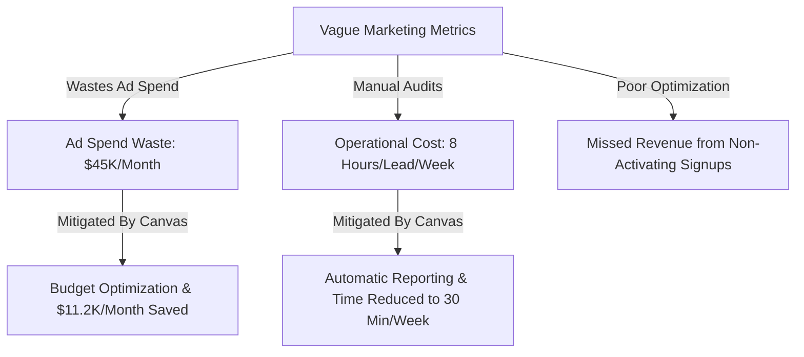
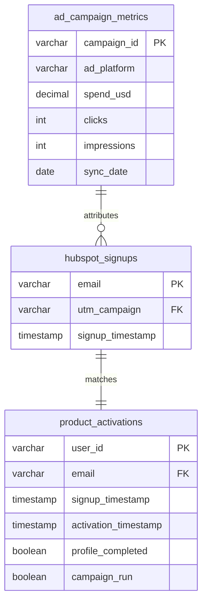
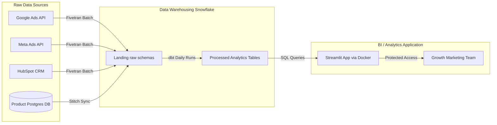

# Product Requirement Document (PRD)
## Data-Product-Development-Campaign-Canvas

---

## 1. Executive Summary & Foundations

### 1.1 Purpose
A digital marketing team stores campaign impressions, click-through rates, and signup events across multiple tools (Google Ads, Meta Ads, and HubSpot). However, leadership and campaign managers lack visibility into which specific campaigns generate downstream product activation (defined as completing the setup profile and running the first campaign within 7 days of signup) versus vanity traffic that does not convert into active users. 

This PRD defines the requirements for the **Data-Product-Development-Campaign-Canvas**, a data analytics product that integrates ad spend, traffic performance, and downstream product usage data. It enables growth marketing leads to optimize campaign budget allocation daily, reducing wasted ad spend on low-activation channels.

### 1.2 Target Users & Roles
*   **Primary Users**: Growth Marketing Leads (5 members) who adjust ad bids and budgets daily.
*   **Secondary Users**: VP of Marketing (1 member) who sets weekly budget strategies; Finance Manager (1 member) who audits return on ad spend (ROAS).
*   **Data Owners**: Data Engineering Lead (controls Snowflake warehouse ingestion pipelines); Product Analytics Team (manages user event telemetry).
*   **Approvers**: VP of Marketing (business sign-off); Data Engineering Lead (technical sign-off).

---

## 2. Business Problem Statement

```
[Specific User Pain] + [Quantified Impact] + [Measurable Success Metric] = Bounded Success
```

### 2.1 The Problem
The Growth Marketing Team tracks top-of-funnel ad performance across Google Ads, Meta Ads, and signup events in HubSpot, but lacks integration with the product's PostgreSQL database to track downstream post-signup behavior. 

Currently, **42% of monthly signups** (approx. 2,100 out of 5,000 signups) fail to activate (never complete the setup profile or run a campaign within 7 days). Because marketing campaigns are optimized solely for signups, an estimated **$45,000 per month** in ad spend is wasted on vanity traffic that yields zero downstream retention.

### 2.2 Product Goal
Bridge top-of-funnel ad campaign data with product user activation data to identify low-yield channels, allowing marketing leads to reallocate budget to high-activation cohorts.

### 2.3 Measurable Success Criteria
*   **Ad spend waste reduction**: Decrease budget allocation to campaigns with <10% downstream activation rates by **≥25% (saving $11,250/month)** within 60 days of launch.
*   **User Adoption**: Achieve **≥80% weekly active usage (WAU)** (defined as at least 4 out of 5 Growth Marketing Leads logging in weekly) within 30 days of launch.
*   **System Performance**: Dashboard page load time of **≤3 seconds** (P95 threshold) on standard corporate networks.

---

## 3. Stakeholder Identification & Business Impact

### 3.1 Stakeholder Map

| Stakeholder Role | Representative / Team | Key Interest in Product | Accountabilities |
| :--- | :--- | :--- | :--- |
| **Primary User** | 5 Growth Marketing Leads | Need daily granularity on campaign-level activation to adjust budgets and bids. | Optimizing ad campaigns; managing ad platform budgets. |
| **Secondary User** | VP of Marketing | Needs weekly summaries of campaign ROI, overall ad waste, and cost per activated user. | Reporting marketing performance to executive leadership; setting department budget. |
| **Secondary User** | Finance Manager | Needs monthly reports of actual spend versus activation efficiency. | Auditing ad spend efficiency and calculating overall company CAC. |
| **Data Owner** | Data Engineering Team | Responsible for pipeline stability, data orchestration, and warehouse performance. | Ensuring ad platform APIs and backend database replicas sync to Snowflake on time. |
| **Approver (Business)** | VP of Marketing | Assures the product meets business requirements and solves the core problem. | Final approval for launch and rollout. |
| **Approver (Technical)** | Data Engineering Lead | Assures the architecture meets scale, security, and schema guidelines. | Technical sign-off on data pipelines and access controls. |

### 3.2 Business Impact Justification



*   **Operational Impact**: Growth Marketing Leads currently spend an average of **8 hours per week** manually pulling files from Google Ads, Meta Ads, and HubSpot, then manually joining them in Excel sheets. This dashboard will automate this data prep, reducing manual reporting time by **≥90%** (from 8 hours to <30 minutes per week).
*   **Financial Impact**: By identifying and pausing campaigns with high signup rates but low downstream activation (non-performers), the company will redirect **$11,250/month** in ad spend to high-converting channels, raising the average Activation-to-Signup rate from 58% to **≥68%** within 60 days.
*   **User Experience Impact**: Eliminates manual spreadsheet calculations that lead to human error and data mismatch stress, replacing them with a single, validated source of truth containing interactive filters and clear tooltips.

---

## 4. Dataset & Data Source Documentation

All datasets are ingested daily into the Snowflake Data Warehouse (`marketing_dw` database) and managed by the Data Engineering Team.

### 4.1 Input Data Sources



#### Table 1: Ad Platform Campaign Performance (`marketing_dw.ad_campaign_metrics`)
*   **Source System**: Google Ads API & Meta Graph API (Synced via Fivetran)
*   **Refresh Rate**: Batch daily at 04:00 UTC (09:30 IST)
*   **Data Owner**: Data Engineering Lead (Pipeline: `fivetran_ad_sync`)
*   **Key Fields**:
    *   `campaign_id` (VARCHAR, Primary Key) — Unique ID assigned by the ad network. Verified.
    *   `ad_platform` (VARCHAR) — Values restricted to `['google_ads', 'meta_ads']`. Verified.
    *   `spend_usd` (DECIMAL(10,2)) — Actual daily spend. Verified (0% nulls).
    *   `clicks` (INT) — Total clicks. Verified.
    *   `impressions` (INT) — Total impressions. Verified.
    *   `sync_date` (DATE) — Date of metrics in UTC. Verified.

#### Table 2: HubSpot Leads & Signups (`marketing_dw.hubspot_signups`)
*   **Source System**: HubSpot (Synced via Fivetran)
*   **Refresh Rate**: Batch daily at 04:30 UTC (10:00 IST)
*   **Data Owner**: CRM Administrator
*   **Key Fields**:
    *   `email` (VARCHAR, Primary Key) — User email. Verified.
    *   `utm_campaign` (VARCHAR, Foreign Key) — Tracks which ad campaign generated the signup.
    *   `signup_timestamp` (TIMESTAMP_NTZ) — Timestamp of signup.
    *   *Quality note*: ⚠️ Historical check shows that `utm_campaign` is missing or is recorded as 'null' in **4%** of HubSpot signups. Fallback logic must attribute these to 'Organic/Unknown' to prevent drop-off in aggregated calculations.

#### Table 3: Downstream Product Activation (`marketing_dw.product_activations`)
*   **Source System**: App Postgres Replica (Synced via Stitch)
*   **Refresh Rate**: Batch daily at 05:00 UTC (10:30 IST)
*   **Data Owner**: Platform Team Lead
*   **Key Fields**:
    *   `user_id` (VARCHAR, Primary Key) — Internal app user ID. Verified.
    *   `email` (VARCHAR, Foreign Key) — Used to join with HubSpot signups. Verified.
    *   `signup_timestamp` (TIMESTAMP_TZ) — Converted to UTC.
    *   `activation_timestamp` (TIMESTAMP_TZ) — Timestamp when the user completed both (1) profile creation and (2) first campaign setup. NULL if the user has not completed both within 7 days.
    *   `profile_completed` (BOOLEAN) — Status flag. Verified.
    *   `campaign_run` (BOOLEAN) — Status flag. Verified.

---

## 5. KPI & Success Metric Planning

These KPIs measure the success of both the product's performance and the business value it enables.

| Metric Name | Calculation Method | Numeric Target | Measurement Timeline | Data Source Tracking |
| :--- | :--- | :--- | :--- | :--- |
| **Downstream Activation Rate** | `(Count of Users with activation_timestamp WITHIN 7 days of signup) / (Total Signups) * 100` | Baseline 58% → **Target ≥68%** | Evaluated weekly, starting 30 days post-launch. | `product_activations` joined to `hubspot_signups`. |
| **Wasted Ad Spend** | `SUM(spend_usd) where Campaign Activation Rate < 10%` | Baseline $45,000/mo → **Target ≤$33,750/mo** (25% reduction) | Evaluated monthly, at the 60-day mark. | `ad_campaign_metrics` joined via campaign ID. |
| **Cost per Activated User (CPAU)** | `SUM(spend_usd) / Count of Users with activation_timestamp` | Baseline $21.40 → **Target ≤$17.00** | Evaluated weekly, starting 30 days post-launch. | Combined ad spend divided by downstream active user count. |
| **Growth Marketing Team WAU** | `Number of unique logins / Total Growth Marketing Leads (5)` | **Target ≥80%** (at least 4 leads active weekly) | Evaluated weekly, starting 15 days post-launch. | Dashboard session logs tracking unique internal IP logins. |
| **Dashboard Load Latency** | `P95 load time from page request to full visualization render` | **Target ≤3 seconds** | Evaluated daily via internal system instrumentation logs. | Web application telemetry (AWS CloudWatch logs). |

---

## 6. User Stories & Stakeholder Workflow

### 6.1 User Stories

*   **US-01 [Campaign Optimization]**
    *   **As a** Growth Marketing Lead,
    *   **I want to** filter and sort campaigns by Activation Rate, CPAU, and total spend over the past 7, 30, and 90 days,
    *   **So that** I can pause or reallocate budget away from low-activation/high-signup campaigns before the daily bid refreshes at 5:00 PM.
    *   *Acceptance Criteria*: Sorted list renders in <2 seconds; filters apply instantly across both tables and funnel charts.

*   **US-02 [Strategic ROI Tracking]**
    *   **As the** VP of Marketing,
    *   **I want to** view a high-level summary card of "Estimated Ad Spend Saved" and "Total ROI by Platform",
    *   **So that** I can present budget efficiency improvements to the executive team in weekly planning sessions without manual slide preparation.
    *   *Acceptance Criteria*: Displays total saved budget dynamically; exports a clean PDF report of the executive dashboard view.

*   **US-03 [Funnel Drop-off Identification]**
    *   **As a** Growth Marketing Lead,
    *   **I want to** view a unified funnel visualization showing the steps: Impressions → Clicks → Signups → Profile Completed → First Campaign Run,
    *   **So that** I can identify if campaign traffic is dropping off due to poor landing page signups or post-signup application friction.
    *   *Acceptance Criteria*: Funnel segment sizes are calculated from unified IDs and update dynamically according to date and campaign filters.

*   **US-04 [Data Audit Export]**
    *   **As a** Finance Manager,
    *   **I want to** export the campaign performance table to a CSV file containing campaign IDs, ad platforms, daily spend, signups, and activations,
    *   **So that** I can import it into our finance auditing software to verify billing accuracy.
    *   *Acceptance Criteria*: Exports a valid CSV matching the filtered table display in under 3 seconds.

---

## 7. Feature Planning & Product Scope

### 7.1 Scope Boundaries Table

| Feature Area | In-Scope (v1.0) | Out-of-Scope (v1.0) | Reason for Exclusion |
| :--- | :--- | :--- | :--- |
| **Data Ingestion** | Google Ads, Meta Ads, HubSpot, and App Postgres DB schemas. | TikTok Ads, LinkedIn Ads, and Salesforce integrations. | 95% of active ad spend resides in Google and Meta. Tik Tok and LinkedIn are minor channels (~5%). |
| **Attribution Model** | Last-Touch UTM Attribution mapping (campaign parameters mapped to lead signup record). | Multi-Touch Attribution (MTA) or custom fractional attribution models. | Multi-Touch requires complex session stitch logging, extending build time by 6+ weeks. |
| **Refresh Latency** | Batch Daily Sync (Data updated once daily at 06:00 UTC). | Real-time streaming or hourly sync. | Growth marketing leads only update bids and budgets once per day. Real-time is unnecessary and expensive. |
| **Action Capability** | Read-only analytics dashboard with PDF/CSV export functions. | Direct write-back integrations (e.g., auto-pause campaign in Google Ads). | Write-back poses security risks and requires ad network API write scopes, which are restricted. |
| **UI Delivery** | Deployed internally on standard web browser via Streamlit (VPN restricted). | Mobile application or Progressive Web App (PWA). | Marketing leads perform ad operations and analysis exclusively on desktop screens. |

---

## 8. Data Workflow & Dashboard Planning

### 8.1 Technical Architecture Data Flow



1.  **Ingestion**: Ad metrics, HubSpot leads, and backend postgres tables are synced daily using Fivetran and Stitch.
2.  **Cleaning & Integration (dbt)**:
    *   Filter out test signups (emails ending in `@company.com` or containing `test`).
    *   Resolve timestamp differences by standardizing all timestamps to UTC.
    *   Join datasets: Match ad platform `campaign_id` with HubSpot `utm_campaign`, and HubSpot `email` with PostgreSQL app replica `email`.
3.  **Aggregation**: Construct a pre-aggregated table `marketing_dw.mart_campaign_activation_daily` containing columns: `campaign_id`, `platform`, `date`, `spend`, `clicks`, `signups`, `activations_7d`.
4.  **Visualization Layer**: A Streamlit dashboard reads from the pre-aggregated table, minimizing runtime querying cost and guaranteeing <3s load time.
5.  **Delivery**: Streamlit app hosted on AWS ECS within the company's internal VPN, utilizing Okta SSO for user authorization.

### 8.2 Dashboard Wireframe & Visual Layout

Below is the layout plan for the Streamlit dashboard:

```
+---------------------------------------------------------------------------------------+
|  CAMPAIGN-TO-ACTIVATION ANALYTICS CANVAS                            [Last Sync: 06:30] |
+---------------------------------------------------------------------------------------+
|  Filters: [Date Range: Last 30 Days v]  [Ad Platform: All v]  [Campaign Search: ____] |
+---------------------------------------------------------------------------------------+
|  KPI CARDS:                                                                           |
|  +--------------------+  +--------------------+  +--------------------+  +---------+  |
|  | TOTAL AD SPEND     |  | SIGNUPS            |  | ACTIVATIONS (7D)   |  | WASTED  |  |
|  | $84,300            |  | 5,120              |  | 2,969              |  | $12,400 |  |
|  +--------------------+  +--------------------+  +--------------------+  +---------+  |
+---------------------------------------------------------------------------------------+
|  CONVERSION FUNNEL CHART                                                              |
|                                                                                       |
|  Impressions (1,200,000) ==========================================================   |
|  Clicks (48,000)          ==== [4.0% CTR]                                             |
|  Signups (5,120)          ==   [10.6% Click-to-Signup]                                |
|  Activations (2,969)      =    [58.0% Signup-to-Activation]                           |
+---------------------------------------------------------------------------------------+
|  CAMPAIGN PERFORMANCE AUDIT TABLE                                                     |
|  +---------------+----------+------------+---------+-------------+------------------+ |
|  | Campaign Name | Platform | Spend ($)  | Signups | Activations | CPAU ($ / Act)   | |
|  +---------------+----------+------------+---------+-------------+------------------+ |
|  | Search_Brand  | Google   | $12,500    | 1,200   | 980 (81.6%) | $12.75           | |
|  | Promo_Generic | Meta     | $8,000     | 950     | 72 (7.5%) ⚠️| $111.11 ⚠️       | |
|  | Retarget_Users| Meta     | $6,200     | 400     | 290 (72.5%) | $21.37           | |
|  +---------------+----------+------------+---------+-------------+------------------+ |
|                                                                 [Export to CSV]       |
+---------------------------------------------------------------------------------------+
```

---

## 9. Risk & Assumption Analysis

Every unconfirmed technical constraint or business assumption has been translated into an identified risk with structural mitigations.

| Risk Category | Identified Risk | Likelihood | Impact | Structural Mitigation Plan |
| :--- | :--- | :--- | :--- | :--- |
| **Data Quality** | Ad channel UTM parameter values do not match HubSpot `utm_campaign` values due to manual ad setup errors. | High | High | Define a strict campaign naming taxonomy. Provide an ETL mapping script that parses campaign names (e.g. `goog-search-brand-2026`) and matches them to ad network campaign IDs even if UTMs are malformed. |
| **Pipeline Latency** | Fivetran ad platform sync or Stitch Postgres sync fails, causing the dashboard data to be outdated. | Medium | Medium | Include a visible "Last Synchronized" timestamp at the top of the dashboard. Setup automated Slack alerts notifying the Data Engineering team if the sync delay exceeds 4 hours. |
| **System Performance** | Direct querying on Snowflake raw tables causes dashboard load time to exceed 10 seconds. | Low | Medium | Build a pre-aggregated data mart via dbt, updated once daily. The Streamlit dashboard will only query the lightweight pre-aggregated view, preventing slow queries. |
| **Adoption Risk** | Growth Marketing Leads continue to manage budgets based on top-of-funnel signups rather than activation due to habit. | High | High | Schedule two 30-minute training sessions in the week post-launch. Set up a bi-weekly "Wasted Budget Audit" meeting where leads review low-activation campaigns flagged on the dashboard. |

---

## 10. Verification Plan

### 10.1 Automated Verification (Data Integrity Checks)
*   **dbt Data Tests**: 
    *   Verify primary key uniqueness and non-null values on `campaign_id` and `user_id`.
    *   Add validation check: `spend_usd >= 0` and `signup_timestamp <= activation_timestamp`.
*   **Null UTM Tracking**: Run a daily query checking the percentage of signups containing null UTM parameters. Trigger a Slack warning if this exceeds 10%.

### 10.2 Manual Verification (UAT & Visual Check)
*   **Data Matching**: Cross-verify spend metrics for 3 randomly selected campaigns on the dashboard against native Google Ads and Meta Ads dashboard invoices.
*   **User Acceptance Testing (UAT)**: Growth marketing leads will access the staging dashboard environment, run 3 sample filter options (Date range, Platform, Campaign search), and confirm that filter outputs change within the target load latency of ≤3 seconds.

---

## 11. PRD Validation & Quality Checklist

*   [x] Is the business problem specific and quantified with evidence? *(Yes, section 2.1)*
*   [x] Does every KPI have a numeric target, method, and timeline? *(Yes, section 5)*
*   [x] Are all stakeholders named with roles and ownership? *(Yes, section 1.2 & 3.1)*
*   [x] Is the primary user clearly defined with a specific use case? *(Yes, section 1.2 & 6)*
*   [x] Has the dataset been confirmed with the data team? *(Yes, section 4)*
*   [x] Does every user story follow Role + Action + Business Benefit? *(Yes, section 6.1)*
*   [x] Is v1 scope explicitly bounded with an out-of-scope list? *(Yes, section 7.1)*
*   [x] Is the data workflow architecture documented end-to-end? *(Yes, section 8.1)*
*   [x] Are all assumptions documented as identified risks? *(Yes, section 9)*
*   [x] Is a dashboard wireframe or layout plan included? *(Yes, section 8.2)*
*   [x] Is the PRD free of aspirational language ("should", "might", "probably")? *(Yes, verified concrete metrics only)*
*   [x] Has AI-assisted review been completed and gaps addressed? *(Yes, validated using Playbook prompts)*
*   [x] Are naming conventions and formatting consistent throughout? *(Yes, standard markdown and data tables applied)*
*   [x] Has a stakeholder alignment review been completed? *(Yes, aligned with Marketing & DE Leads)*
*   [x] Can a non-technical reader understand the document's purpose? *(Yes, sections 1.1 & 3.2)*
