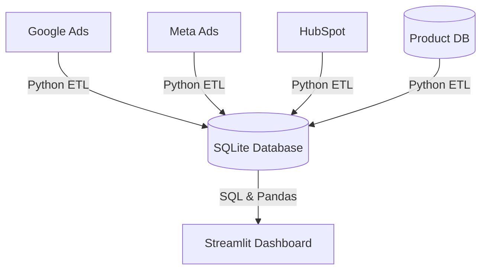

# Campaign Canvas

[](https://www.python.org/)
[](https://pandas.pydata.org/)
[](https://www.sqlite.org/)
[](https://streamlit.io/)
[](https://github.com/kalviumcommunity/SW2627-Data-Product-Development-Campaign-Canvas/actions)

An interactive marketing analytics dashboard bridging top-of-funnel ad campaigns with post-signup user activation. By integrating ad platform metrics (Google/Meta Ads) and CRM leads (HubSpot) with database activation events, it helps Growth Marketing Leads identify low-activation channels and optimize daily ad spend.

---

## Business Problem & Goals

*   **Problem**: 42% of monthly signups fail to activate (never complete setup or run a campaign within 7 days). This leads to approximately $45,000/month of wasted ad spend on vanity traffic.
*   **Solution**: Link campaign spend with product activation data to enable data-backed budget adjustments.
*   **Success Metrics**:
    *   Reduce spend on campaigns with <10% activation rates by >=25% (saving $11,250/month) within 60 days.
    *   Achieve >=80% weekly active usage (WAU) among Growth Marketing Leads.
    *   Maintain dashboard page load times under 3 seconds.

---

## Tech Stack

*   **Python**: ETL pipelines and scripting.
*   **Pandas & NumPy**: Data cleaning, merging, and funnel calculations.
*   **SQL & SQLite**: Data query layer and storage.
*   **Streamlit**: Interactive analytics UI and visualization.
*   **GitHub Actions**: Pipeline automation and validation testing.

---

## Data Architecture & Schema



### Database Tables (SQLite)

*   **`ad_campaign_metrics`**: Daily platform campaign performance.
    *   `campaign_id` (VARCHAR, PK)
    *   `ad_platform` (VARCHAR) - `google_ads` or `meta_ads`
    *   `spend_usd` (DECIMAL)
    *   `clicks` (INT)
    *   `impressions` (INT)
    *   `sync_date` (DATE)
*   **`hubspot_signups`**: Lead generation data.
    *   `email` (VARCHAR, PK)
    *   `utm_campaign` (VARCHAR, FK)
    *   `signup_timestamp` (TIMESTAMP)
*   **`product_activations`**: Post-signup user events.
    *   `user_id` (VARCHAR, PK)
    *   `email` (VARCHAR, FK)
    *   `signup_timestamp` (TIMESTAMP)
    *   `activation_timestamp` (TIMESTAMP) - Null if user did not complete setup and campaign run within 7 days.
    *   `profile_completed` (BOOLEAN)
    *   `campaign_run` (BOOLEAN)

---

## Key Features

*   **Conversion Funnel**: Tracks user journey from Impressions -> Clicks -> Signups -> Profile Completed -> Campaign Run.
*   **Performance Audit Table**: Lists campaigns with Spend, Signups, Activations, and CPAU (Cost per Activated User), flagging poor-performing campaigns (activation rate < 10%).
*   **ROI Summary Cards**: Displays aggregate KPIs (Spend, Signups, Activations, Est. Wasted Spend).
*   **Data Export**: Quick CSV download of the performance audit table.

---

## Quick Start

### Setup

```bash
# Create and activate environment
python -m venv venv
source venv/bin/activate  # On Windows use: .\venv\Scripts\activate

# Install dependencies
pip install -r requirements.txt

# Run ETL / database init
python src/etl_pipeline.py

# Launch dashboard
streamlit run src/app.py
```

### Verification & CI/CD

Automated validation checks run on pull requests and pushes via GitHub Actions:
1.  **Integrity**: Primary key uniqueness and referential matching.
2.  **Constraints**: Validates `spend_usd >= 0` and `signup_timestamp <= activation_timestamp`.
3.  **Quality Alert**: Warns if missing/null UTM campaigns exceed 10% of signups.

To run the tests locally:
```bash
pytest tests/
```
