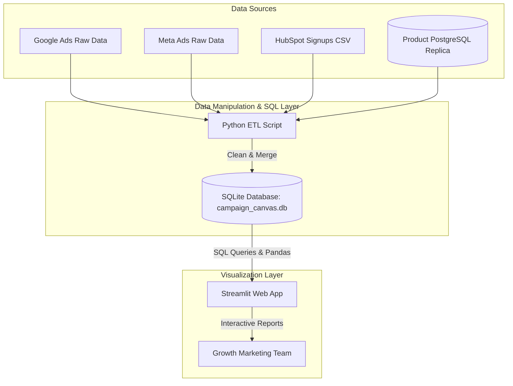

# Campaign Canvas: Data-Product-Development-Campaign-Canvas

[](https://www.python.org/)
[](https://pandas.pydata.org/)
[](https://www.sqlite.org/)
[](https://streamlit.io/)
[](https://github.com/kalviumcommunity/SW2627-Data-Product-Development-Campaign-Canvas/actions)

An interactive, data-driven marketing analytics dashboard that bridges top-of-funnel ad campaigns with downstream post-signup product activation. 

By integrating ad platform metrics (Google & Meta Ads) and CRM leads (HubSpot) with application activation events, the **Campaign Canvas** provides Growth Marketing Leads with a single source of truth to identify vanity traffic and redirect budgets to high-converting channels.

---

## 📖 Table of Contents
1. [Business Problem & Goals](#-business-problem--goals)
2. [Tech Stack](#-tech-stack)
3. [Key Features](#-key-features)
4. [Data Architecture & Schema](#-data-architecture--schema)
5. [KPIs & Success Metrics](#-kpis--success-metrics)
6. [Getting Started](#-getting-started)
7. [Automated Verification & CI/CD](#-automated-verification--cicd)

---

## 🎯 Business Problem & Goals

### The Challenge
Currently, **42% of monthly signups** (approx. 2,100 out of 5,000 signups) fail to activate (meaning they never complete their profile setup or run their first campaign within 7 days). Because campaigns are optimized solely for signups rather than downstream activation, an estimated **$45,000 per month** in ad spend is wasted on low-yield traffic. 

### The Solution
The Campaign Canvas links ad spend, traffic performance, and downstream product usage. This enables Growth Marketing Leads to adjust daily bids and budgets, eliminating wasted spend on campaigns with low activation rates.

### Success Criteria
*   **Ad Spend Waste Reduction**: Decrease budget allocation to campaigns with $<10\%$ downstream activation rates by **$\ge 25\%$ (saving $\$11,250/\text{month}$)** within 60 days of launch.
*   **User Adoption**: Achieve **$\ge 80\%$ weekly active usage (WAU)** among Growth Marketing Leads within 30 days.
*   **System Performance**: Dashboard page load time of **$\le 3\text{ seconds}$** (P95 threshold).

---

## 🛠️ Tech Stack

*   **Language**: **Python** (Scripting, ETL pipelines, and data analysis)
*   **Data Manipulation**: **Pandas & NumPy** (Data clean-up, merging source files, and computing funnel aggregates)
*   **Database Layer**: **SQL / SQLite** (Querying pre-aggregated models and managing clean relational tables)
*   **Interactive Dashboard**: **Streamlit** (Building responsive UI widgets, conversion funnels, and data export features)
*   **Pipeline Automation**: **GitHub Actions** (Running CI/CD workflows for data integrity tests and dashboard validation checks)

---

## ✨ Key Features

*   **Multi-Platform Funnel Chart**: A unified conversion funnel visualising `Impressions ➔ Clicks ➔ Signups ➔ Profile Completed ➔ First Campaign Run`.
*   **Campaign Performance Audit Table**: An interactive, sortable, and filterable table displaying Campaign Name, Platform, Spend, Signups, Activations, and CPAU (Cost per Activated User), with visual alerts (⚠️) for non-performing campaigns (activation rate $< 10\%$).
*   **ROI Summary Cards**: Real-time business KPIs displaying Total Ad Spend, Total Signups, Total Activations, and Est. Wasted Ad Spend.
*   **Audit-Ready Exports**: One-click "Export to CSV" for the filtered table data, matching internal finance audit requirements.

---

## 🏗️ Data Architecture & Schema



### Database Tables (SQLite Schema)

#### 1. `ad_campaign_metrics`
Tracks daily performance metrics from individual ad networks.
*   `campaign_id` *(VARCHAR, Primary Key)*: Unique identifier from the ad network.
*   `ad_platform` *(VARCHAR)*: Ad source; restricted to `google_ads` or `meta_ads`.
*   `spend_usd` *(DECIMAL(10,2))*: Actual daily budget spent.
*   `clicks` *(INT)*: Number of click-through events.
*   `impressions` *(INT)*: Ad impressions served.
*   `sync_date` *(DATE)*: Metric recording date.

#### 2. `hubspot_signups`
Captures lead acquisition records and associated UTM campaign identifiers.
*   `email` *(VARCHAR, Primary Key)*: Signup user email address.
*   `utm_campaign` *(VARCHAR, Foreign Key)*: Links to `ad_campaign_metrics.campaign_id`.
*   `signup_timestamp` *(TIMESTAMP)*: Exact date and time of registration.
*   *Fallback Logic*: If `utm_campaign` is null, it is defaulted to `'Organic/Unknown'` in the ETL layer to prevent drop-off.

#### 3. `product_activations`
Represents the downstream product actions.
*   `user_id` *(VARCHAR, Primary Key)*: Internal product user identifier.
*   `email` *(VARCHAR, Foreign Key)*: Matches to `hubspot_signups.email`.
*   `signup_timestamp` *(TIMESTAMP)*: Signup date.
*   `activation_timestamp` *(TIMESTAMP, Nullable)*: Captured when a user completes both profile creation and their first campaign setup within 7 days of signup.
*   `profile_completed` *(BOOLEAN)*: Profile status.
*   `campaign_run` *(BOOLEAN)*: Flag for running their first campaign.

---

## 📊 KPIs & Success Metrics

The following metrics are computed in Python/SQL and visualized on the dashboard:

$$\text{Downstream Activation Rate} = \frac{\text{Users Activated within 7 Days}}{\text{Total Campaign Signups}} \times 100$$

$$\text{Cost per Activated User (CPAU)} = \frac{\text{Total Spend (USD)}}{\text{Total Downstream Activations}}$$

$$\text{Wasted Ad Spend} = \sum \text{spend\_usd} \quad (\text{for campaigns where Activation Rate} < 10\%)$$

---

## 🚀 Getting Started

### Prerequisites
*   Python 3.9 or higher
*   SQLite3

### Installation

1.  **Clone the Repository**:
    ```bash
    git clone https://github.com/kalviumcommunity/SW2627-Data-Product-Development-Campaign-Canvas.git
    cd SW2627-Data-Product-Development-Campaign-Canvas
    ```

2.  **Create a Virtual Environment**:
    ```bash
    python -m venv venv
    ./venv/Scripts/activate  # On Windows PowerShell
    # source venv/bin/activate # On macOS/Linux
    ```

3.  **Install Dependencies**:
    ```bash
    pip install -r requirements.txt
    ```

4.  **Initialize Database & Ingest Sample Data**:
    ```bash
    python src/etl_pipeline.py
    ```

5.  **Launch the Streamlit Dashboard**:
    ```bash
    streamlit run src/app.py
    ```

---

## ⚙️ Automated Verification & CI/CD

This project uses **GitHub Actions** to automate quality checks on every pull request and push to the `main` branch. 

### Data Integrity & Validation Pipeline
Our CI pipeline runs automated checks via Python unit tests and SQLite queries:
1.  **Primary Key Uniqueness**: Verifies no duplicate `campaign_id`, `email`, or `user_id` records exist.
2.  **Referential Integrity**: Checks that signups and activations properly map without orphan records.
3.  **Constraint Checks**: Ensures that `spend_usd >= 0` and `signup_timestamp <= activation_timestamp`.
4.  **Data Quality Monitoring**: Flags a warning if the percentage of missing/null UTM campaign signups exceeds 10%.

To run the test suite locally:
```bash
pytest tests/
```
